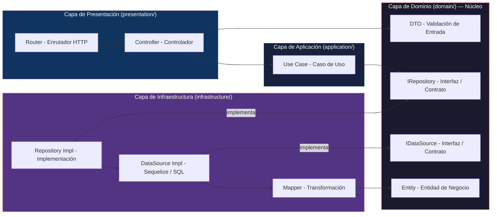
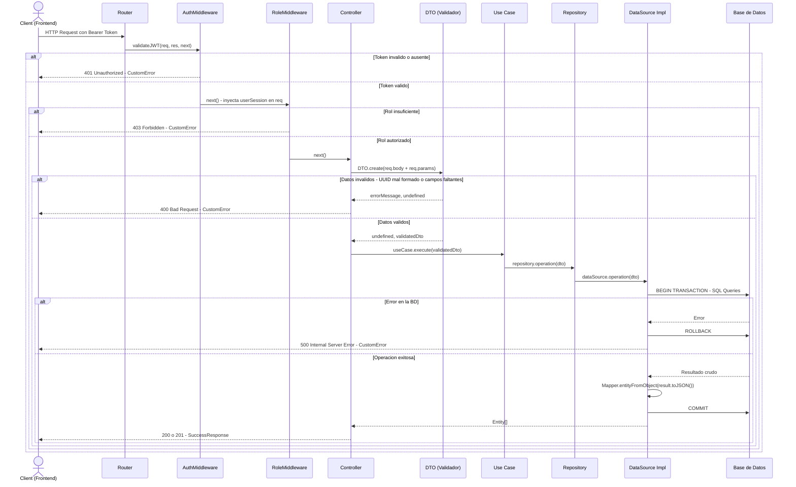
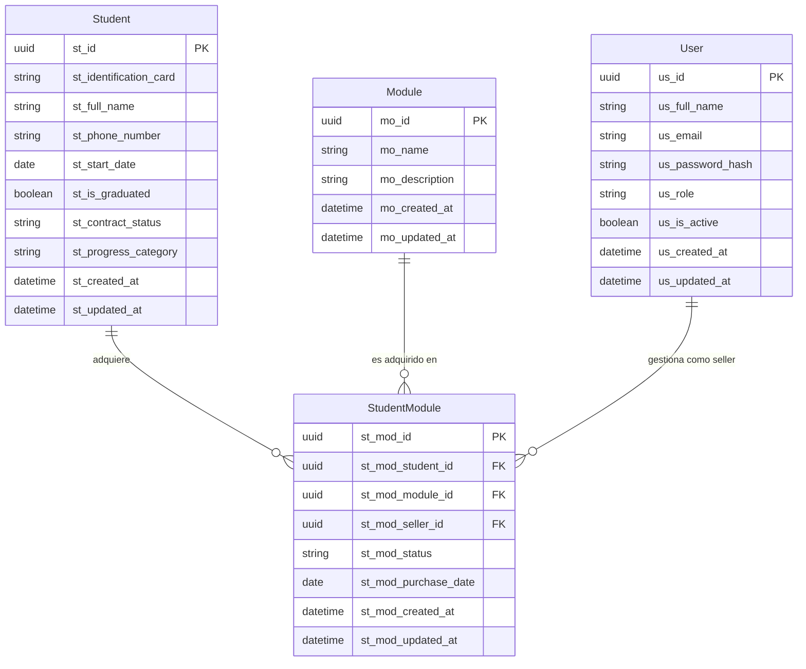
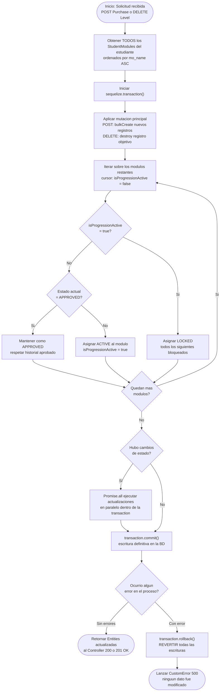

# Arquitectura del Sistema (Backend)

Este documento es la referencia oficial ("Biblia") de la arquitectura técnica, decisiones de diseño estructurales y convenciones del sistema backend del proyecto.

## 1. Visión General y Stack Tecnológico

El propósito global del backend es proveer una API RESTful robusta, predecible y altamente mantenible para la gestión académica e institucional (sistema de módulos para estudiantes, registros de asistencia, usuarios, etc.). Está diseñado para soportar procesos críticos empresariales a través de reglas de auto-sanación, consistencia estricta en base de datos y un empaquetado seguro.

### Stack Tecnológico

- **Lenguaje:** TypeScript (Aporta tipado estático, interfaces rigurosas orientadas a objetos y seguridad en tiempo de compilación).
- **Entorno de Ejecución:** Node.js (Servidor asíncrono, basado en eventos).
- **Entorno de Construcción y Pruebas:** Bun. Utilizamos `bun:test` como motor unificado para la suite de testing (unitario y de integración) por su extrema velocidad y soporte nativo para TypeScript.
- **Framework Web:** Express.js (Gestión de enrutamiento y ciclo de vida de peticiones HTTP).
- **Capa de Datos (ORM):** Sequelize-Typescript (Mapeo objeto-relacional (ORM) decorado, diseñado para integrarse con PostgreSQL/MySQL con máxima seguridad en las sentencias mediante el uso de transacciones).

---

## 2. Patrón Arquitectónico: Clean Architecture

El proyecto no acopla la lógica de negocio al Framework ni a la Base de Datos. Implementamos estricta y rígidamente el modelo de **Clean Architecture** (Arquitectura Limpia). Las dependencias siempre apuntan hacia adentro, aislando el dominio de los detalles de implementación mediante Inversión de Dependencias (Interfaces).

Cada sub-módulo dentro del sistema respeta 4 capas fundamentales:

### A. Capa de Dominio (`domain/`)

Es el corazón del software. No tiene dependencias externas (ni de Express, ni Sequelize).

- **Entities:** Reglas de negocio puras; es encapsulamiento estructurado en clases (ej: `StudentLevelEntity`).
- **Interfaces (Contracts):** Definen los contratos obligatorios (`Repositories`, `DataSources`). Dictan _qué_ debe poder hacerse, pero no _cómo_.
- **DTOs (Data Transfer Objects):** Objetos de transferencia de información. Todo DTO cuenta con un constructor privado estático (`ClassName.create(object)`) que sirve como barrera infranqueable de validación, asegurando que la data ingresada a la lógica pura posea formatos correctos o retornando un error temprano.

### B. Capa de Aplicación (`application/`)

Orquesta el flujo del software.

- **Casos de Uso (Use Cases):** Componentes aislados donde ocurren los flujos organizados (ej. `PurchaseModules`). Un Caso de Uso inyecta un Repositorio (una interfaz) y ejecuta una acción, delegando lógicas técnicas y devolviendo Entidades puras hacia las capas externas.

### C. Capa de Presentación (`presentation/`)

Punto de contacto con el mundo exterior (la web).

- **Routers:** Organizan las rutas y asignan Endpoints HTTP. Inyectan los Middlewares de Seguridad (`AuthMiddleware`, `RoleMiddleware`).
- **Controllers:** Reciben los objetos `Request`, `Response` y `NextFunction` de Express. Extraen la información, generan los DTOs, las inyectan en los Casos de Uso instanciados y mandan la respuesta HTTP (validez 200/201 utilizando la utilidad unificada `SuccessResponse`) o lanzan los errores de capa superior hacia el manejador global.

### D. Capa de Infraestructura (`infrastructure/`)

Donde residen los detalles técnicos y librerías externas.

- **DataSources Impl:** Implementaciones concretas de nuestras interfaces de persistencia, vinculadas a `Sequelize`. Aquí vive el dialecto SQL a través del ORM.
- **Repositories Impl:** Encapsulan los Datasources. Son inyectados desde el Enrutador hacia el Controlador y Caso de Uso en tiempo de inicialización de la ruta HTTP.
- **Mappers:** Transforman los crudos resultados agnósticos o de Sequelize (`toJSON()`) en Entidades puras del `Domain`, impidiendo que métodos técnicos de la base de datos se infiltren en nuestros Use Cases.

---

## 3. Decisiones de Diseño Core (Design Patterns & Reglas)

### Transacciones Atómicas (ACID)

La consistencia de los registros contables, curriculares y de facturación nunca debe corromperse. En los _Datasources_ (p.ej.: `contract.datasource.impl.ts`), utilizamos explícitamente `sequelize.transaction()` para controlar bloques de operaciones múltiples (como un `bulkCreate` y un ciclo iterativo de actualización).
Toda lógica de persistencia múltiple viaja en el mismo `transaction`; si falla un solo registro, capturamos el fallo en nuestro `catch` y disparamos `transaction.rollback()` para garantizar que la Base de Datos regrese al punto en el tiempo limpio, sin generar escrituras "a medias".

### Manejo de Errores Escalonados (`CustomError`)

Toda excepción viajando en la aplicación está parametrizada mediante nuestra clase abstracta `CustomError` (ubicada en `src/core/error/`).
El Middleware final de Express (`globalErrorHandler.mid.ts`) intercepta estos errores y devuelve repuestas con esquemas organizados que el Frontend comprende y digiere sin ambigüedades:

- `CustomError.badRequest(msg)` -> 400 Bad Request
- `CustomError.unauthorized(msg)` -> 401
- `CustomError.notFound(msg)` -> 404
- `CustomError.internalServer(msg)` -> 500

El `DTO` sirve como el centinela en la Capa de Presentación: si el DTO falla en el factory estático `create()`, devuelve inmediatamente tupla string de error e insta al Controlador a efectuar un throw `CustomError.badRequest()`.

### Auto-Sanación y Control en Cascada (Self-Healing Algorithm)

Ciertas características funcionales complejas (como la adquisición de módulos de educación por secuencias `StudentLevels`) requieren que se respete el progreso histórico. En lugar de permitir corrupción del hilo temporal por acciones de los operarios del sistema (cómo actualizar un Contrato `A2` a `ACTIVE` cuando existían predecesores no culminados), hemos integrado en los endpoints como `PATCH` y `DELETE` el Algoritmo de Auto-Sanación.
Éste reescribe localmente el árbol de Módulos (usando punteros lógicos) para forzar los estatus al vector real (sólo un módulo `ACTIVE`, los demás en `APPROVED` o subsecuentes bloqueados en `LOCKED`).

---

## 4. Mapa de Subsistemas y Dominios

Los contextos funcionales de nuestra App residen bajo `src/app/` y se interconectan con los modelos localizados en `src/data/models/`.

### ▶ AdminDesk

Orientado a la administración administrativa, de matrículas y control de módulos de estudio estudiantiles.

- **Dominios / Subsistemas:** `contracts` (Niveles estudiantiles), `core`, `modules` (Inventario de módulos), `students` (Estudiantes matriculados).
- **Modelos DB expuestos:**
    - `Student` (Datos del estudiante).
    - `Module` (Línea general de Cursos/Niveles).
    - `StudentModule` (Relación tabla pivot transaccional, controla el estado de cada compra).

### ▶ Shared

Recursos y contextos transversales a todo el sistema.

- **Dominios / Subsistemas:** `Identity` (Gestión de Autenticación, Usuarios del sistema y Seguridad).
- **Modelos DB expuestos:**
    - `User` (Almacena Roles —ADMIN, TEACHER—, Hash criptográfico y Correo de cada colaborador interno).

### ▶ ClassTrack

Orientado puramente a la gestión física o remota de impartición de clases por parte de los profesores.

- **Modelos DB expuestos (Dominios en desarrollo):**
    - `AttendanceSession` (Registros de las nóminas del pase de asistencia listadas).
    - `LessonLog` (Bitácoras sobre los temas impartidos por jornada).
    - `RetentionAlert` (Monitoreo de asistencia y riesgo de deserción por ausentismo).

---

## 5. Seguridad y Middlewares

Toda la plataforma yace sobre un sistema enrutador de nivel superior que blinda y protege las ramas mediante inmersión de Guardianes (Middlewares de filtro puro). Estos se agrupan globalmente desde `src/core/middleware/`.

1.  **AuthMiddleware (`validateJWT`):** Intercepta el Bearer Token entrante en las Cabeceras HTTP, valida su firma criptográfica utilizando adaptadores de infra pura (`JwtAdapter`), y si la firma es oficial, inyecta la carga útil descifrada (roles e identidades) en las propiedades del Express Request. Con esto extraemos el `sellerId` dinámicamente en memoria, impidiendo que dependamos de enviarlo via `req.body`.
2.  **RoleMiddleware (`isAdmin`, `isTeacher`, etc.):** Actúa tras el AuthMiddleware. Determina y bloquea en su totalidad rutas transaccionadas para evitar que empleados con menor jerarquía consulten o muten áreas de administración.
3.  **VerifyUUID (`validate`):** Validador Router-Level que blinda toda conexión URL que posea un fragmento o parámetro tipo `/:id`. Intercepta peticiones mal formadas y devuelve `400 Bad Request` en caso de no poseer el estándar V4 de los Universally Unique Identifiers de nuestra Base de Datos. Impide sobrecargas y crasheos en el ORM.

---

## 6. Anexos Visuales: Arquitectura Global

### 6.1 Diagrama de Capas — Regla de Dependencia (Clean Architecture)

Las flechas representan dependencias. La **Regla de la Dependencia** establece que el código fuente solo puede apuntar hacia adentro. Las capas externas conocen a las internas, pero nunca al revés. El `Domain` no importa nada de `Infrastructure` ni de `Presentation`.

---

### 6.2 Diagrama de Secuencia — Ciclo de Vida de una Petición HTTP

Muestra el camino completo de un Request entrante, incluyendo los puntos de fallo temprano (cortocircuito) por validaciones en Middlewares y en los DTOs.

---

### 6.3 Diagrama Entidad-Relación (ERD) — Subsistema AdminDesk

La tabla `StudentModule` actúa como pivote relacional: registra la compra de un `Module` por parte de un `Student`, gestionada por un `User` en rol de seller (vendedor).

---

### 6.4 Diagrama de Flujo — Auto-Sanación y Transacciones Atómicas

Ilustra la lógica core del `DataSource` ante una compra (`POST`) o eliminación (`DELETE`) de un nivel estudiantil. El algoritmo recorre los módulos ordenados alfabéticamente y reasigna el estado correcto a cada uno, garantizando que exista únicamente un estado `ACTIVE` en la línea temporal del estudiante.

